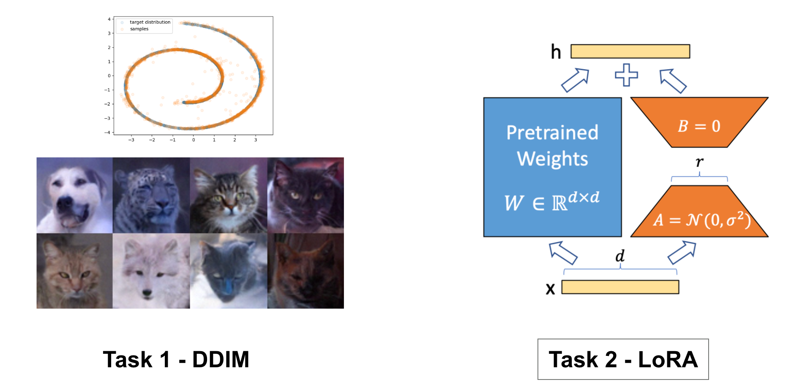
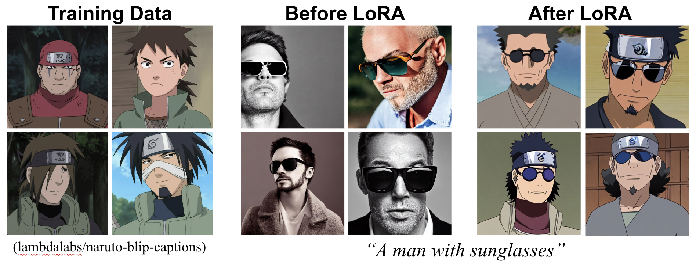
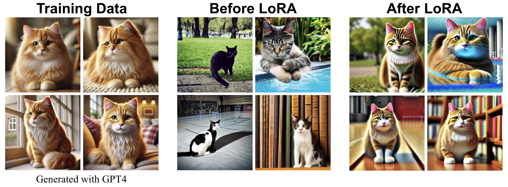

<div align=center>
  <h1>
  Denoising Diffusion Implicit Models (DDIM) and LoRA  
  </h1>
  <p>
    <b>NYCU: Image and Video Generation (2025 Fall)</b><br>
    Programming Assignment 2
  </p>
</div> 

<div align=center>
  <p>
    Instructor: <b>Yu-Lun Liu</b><br>
    TA: <b>Huai-Hsun Cheng</b> <b>Siang-Ling Zhang</b>
  </p>
</div>

---

## 📘 Abstract


(1) **Denoising Diffusion Implicit Models (DDIM)** is a more efficient variant of Denoising Diffusion Probabilistic Models (DDPM) that uses deterministic sampling steps instead of stochastic sampling steps. The main objective of Task 1 is to become familiar with the DDIM sampling process and its advantages over DDPM.  We begin with a simple 2D toy dataset (Swiss Roll) to understand DDIM sampling and its advantages over DDPM.  
Then, we extend the pipeline to real images (AFHQ dataset), where DDIM reduces sampling time without requiring us to retrain our DDPMs from scratch. We will experiment with different predictors and evaluate performance using the FID metric.  

(2) **LoRA (Low-Rank Adaptation)** is an efficient fine-tuning technique for neural networks that enables the customization of diffusion models with relatively small datasets, ranging from a few images to a few thousand. The main objective of Task 2 is to become familiar with the LoRA fine-tuning process for diffusion models. Instead of implementing LoRA from scratch, you will utilize a pre-existing LoRA module available in the diffusers library. This task will allow you to creatively develop and fine-tune a diffusion model tailored to your specific data and task requirements. Moreover, you will experiment with DreamBooth to create personalized diffusion models based on a particular subject of your choice.

- [Assignment Instructions (PDF)](./assets/Lab2-DDIM-LoRA.pdf)
- [Denoising Diffusion Implicit Models (DDIM) – arXiv](https://arxiv.org/pdf/2010.02502)
- [LoRA: Low-Rank Adaptation of Large Language Models – arXiv](https://arxiv.org/pdf/2106.09685)

---

## ⚙️ Setup

### Environment
Create a `conda` environment and install dependencies:
```bash
conda create -n lab2-ddim-lora python=3.9 -y
conda activate lab2-ddim-lora
pip install -r requirements.txt
```
---

📂 Code Structure
```
.
├── task1 (Task 1: DDIM)
│   ├── 2d_plot_diffusion_todo (Task 1-1: Swiss Roll)
│   │   ├── chamferdist.py
│   │   ├── dataset.py
│   │   ├── ddpm.py                # TODO: Implement DDIM sampling (ddim_p_sample, ddim_p_sample_loop)
│   │   ├── ddpm_tutorial.ipynb
│   │   ├── __init__.py
│   │   └── network.py
│   └── image_diffusion_todo (Task 1-2: Image Generation)
│       ├── dataset.py            # AFHQ dataset loader
│       ├── fid                   # FID evaluation tools
│       ├── model.py              # Diffusion model
│       ├── module.py             # Basic modules of a prediction network
│       ├── network.py            # Prediction network
│       ├── sampling.py           # Image sampling script for both DDIM and DDPM
│       ├── scheduler.py          # TODO: Implement DDIM scheduler
│       └── train.py              # Training code
└── task2 (Task 2: LoRA)
    ├── lora_inference.ipynb
    ├── sample_data
    │   ├── artistic-custom
    │   └── dreambooth-cat
    ├── scripts
    │   ├── train_dreambooth_lora.sh  # Training script for DreamBooth + LoRA
    │   ├── train_lora_custom.sh      # Training script for LoRA w/ custom data
    │   └── train_lora.sh             # Training script for LoRA
    ├── train_dreambooth_lora.py      # Training code for DreamBooth + LoRA
    ├── train_lora.py                 # Training code for LoRA
    └── utils.py
```
---
<h2><b>📝 Task 1 – DDIM</b></h2>

<h3><b>Task 1-1: Swiss Roll DDIM</b></h3>

> Implement and test DDIM sampling on a 2D Swiss Roll dataset.

**Key TODOs:**
- DDIM sampling functions: `ddim_p_sample`, `ddim_p_sample_loop` (ddpm.py)

<h3><b>Task 1-2: Image Generation with DDIM</b></h3>

> Extend DDIM sampling on image diffusion.

**Key TODOs:**
- DDIM scheduler implementation (`scheduler.py`)  

**Experiments:**
- Sample with different steps and eta
- Evaluate with FID score

**🚀 Usage**

**DDIM Sampling**
```bash
cd task1/image_diffusion_todo/
python sampling.py --ckpt_path {CKPT} --save_dir {SAVE_DIR} \
--sample_method ddim \
--ddim_steps {DDIM_STEPS} \
--eta {ETA}
```
> **Parameters:** \
> `--sample_method`: ddpm, ddim \
> `--ddim_steps`: Number of DDIM inference steps \
> `--eta`: DDIM eta parameter

**Evaluation**
```bash
cd task1/image_diffusion_todo/
python dataset.py   # Run once to prepare AFHQ eval set
python fid/measure_fid.py {GT_IMG_DIR} {GEN_IMG_DIR}
```

<h2><b>📝 Task 2 – LoRA</b></h2>

**Key TODOs:**
- Train LoRA on a specific visual style.
- Train DreamBooth with LoRA on a specific identity.

<h3><b>Task 2-1. Train LoRA on a Specific Visual Style</b></h3>

> Train a LoRA for a specific "style". It could be artistic, cinematic, photographic, or any other visual style. You have two options to choose a dataset for training LoRA.


**(Option 1) Use an open-source dataset**

You can utilize various open-source image-caption datasets for LoRA training, many of which are available on Hugging Face. For instance, you can explore datasets listed here. By replacing the `DATASET_NAME` argument with the desired dataset, you can seamlessly train LoRA with new data. Additionally, you are welcome to use any other open-source datasets, provided that you clearly cite the appropriate references.


**🚀 Usage**

We provide the code for LoRA training of Stable Diffusion 1.4 in train_lora.py. You can simply run the code using:

```bash
cd task2/
sh scripts/train_lora.sh
```

The default training dataset is set as:
```bash
export DATASET_NAME="lambdalabs/naruto-blip-captions"
```
which consists of Naruto images with synthetic captions generated with [BLIP-2](https://github.com/salesforce/BLIP). The below image shows the outputs of Stable Diffusion before and after LoRA training on this dataset. You can first check if LoRA works properly based on this dataset. The validation images after each epoch will be stored in {$output_dir}/validation/.

A simple inference code for Stable Diffusion with LoRA is provided at [inference_lora.ipynb](task2/lora_inference.ipynb).



(Credit: lambdalabs/naruto-blip-captions)

**(Option 2) Prepare your own dataset**

If you want to try training LoRA on your own creative dataset, you can refer to `task2/scripts/train_lora_custom.sh` for the necessary arguments to train on a custom dataset. Be sure to update the `TRAIN_DATA_DIR` to point to the directory containing your data. We provide a sample dataset in `task2/sample_data/artistic-custom` consisting of four images, which were generated using GPT-4. The image below showcases the results of LoRA training on this sample dataset.

**🚀 Usage**

Refer to [this link](https://huggingface.co/docs/datasets/v2.4.0/en/image_load#imagefolder) for how to organize the dataset folder. Then, train the LoRA using:

```bash
sh scripts/train_lora_custom.sh
```

<h3><b>Task 2-2. Train DreamBooth with LoRA on a Specific Identity</b></h3>

> Your objective is to train a DreamBooth model with LoRA to accurately capture and reproduce the identity of a specific subject. This subject could be anything personally meaningful to you, such as your own face, your pet, a favorite doll, or any other identifiable entity.
>
> [DreamBooth](https://arxiv.org/abs/2208.12242) is a fine-tuning technique that allows diffusion models to learn a unique identifier for a specific subject, enabling the generation of images featuring that exact subject post-training. By combining DreamBooth with LoRA, you can achieve this fine-tuning with only a small number of images and in a relatively short time frame.

**🚀 Usage**

You can run DreamBooth + LoRA using:

```bash
sh scripts/train_dreambooth_lora.sh
```

We provide a sample dataset for training DreamBooth in `task2/sample_data/dreambooth-cat/.` To use your own data, simply update the `INSTANCE_DIR` to point to your data directory.



<h2><b>📦 Submission</b></h2>

Submit a single zip file {ID}_lab2.zip including:
- Report (report.pdf)
- Code (without checkpoints and dataset)
- (Task1) The complete code for Task 1, excluding checkpoints and datasets.
- (Task2) Provide the LoRA weight cloud link in a text file. 
The file name should be: {ID}_task2-1_lora_weight.

Example:
```
{ID}_lab2.zip
├── report.pdf
├── task1
│   ├── 2d_plot_diffusion_todo
│   │   ├── __init__.py
│   │   ├── chamferdist.py
│   │   ├── dataset.py
│   │   ├── ddpm_tutorial.ipynb
│   │   ├── ddpm.py
│   │   └── network.py
│   └── image_diffusion_todo
│       ├── dataset.py
│       ├── model.py
│       ├── module.py
│       ├── network.py
│       ├── sampling.py
│       ├── scheduler.py
│       └── train.py
└── task2
    ├── {ID}_task2-1_lora_weight.txt
    └── {ID}_task2-2_lora_weight.txt
```

